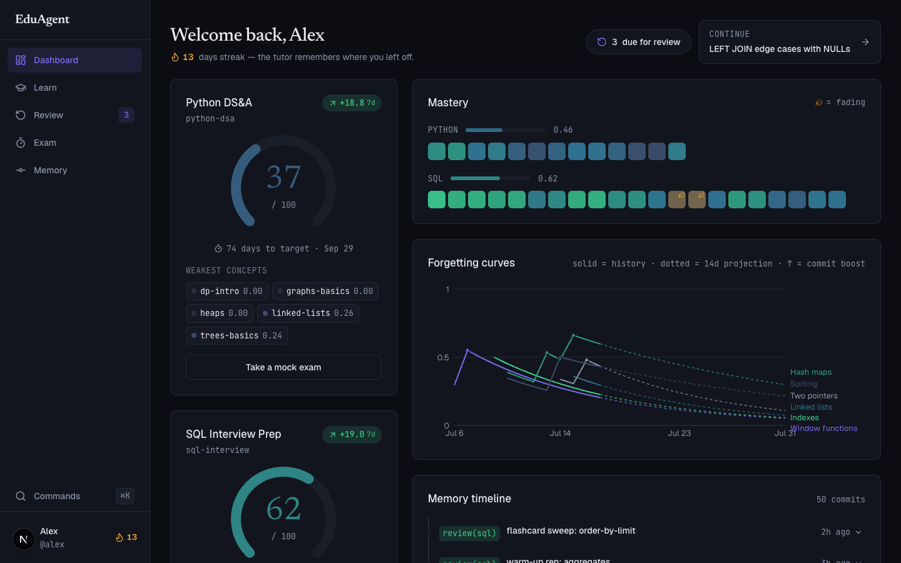
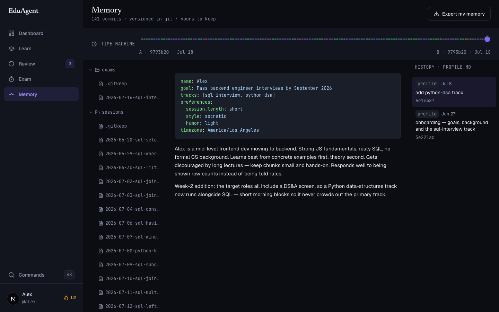
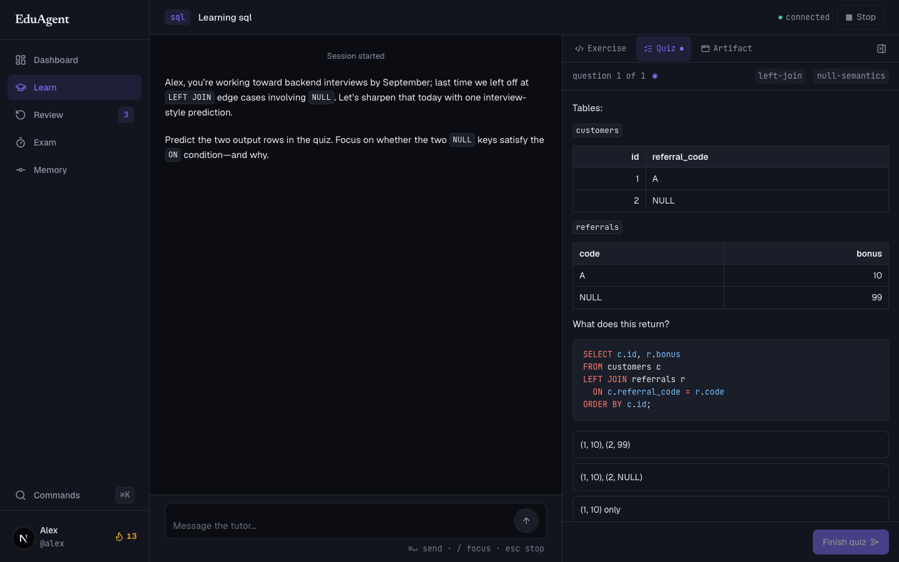
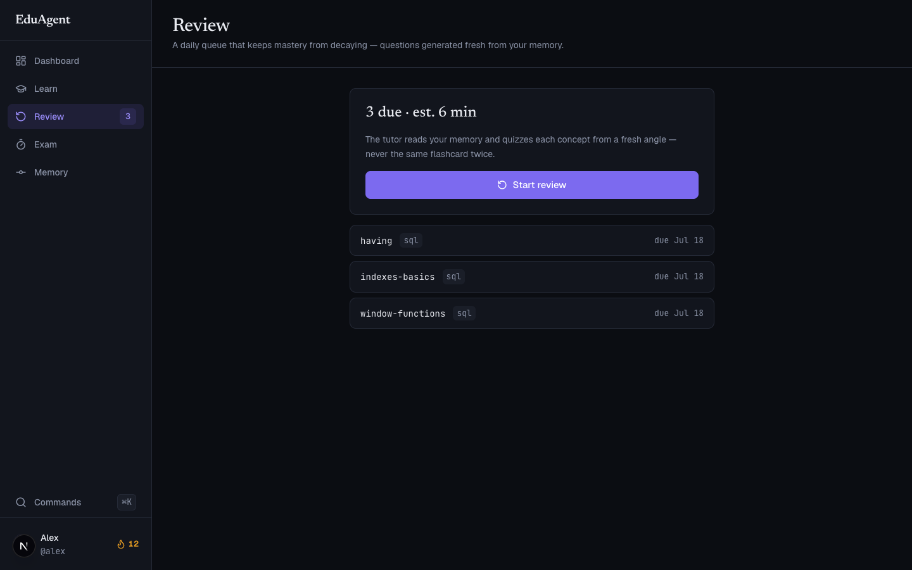
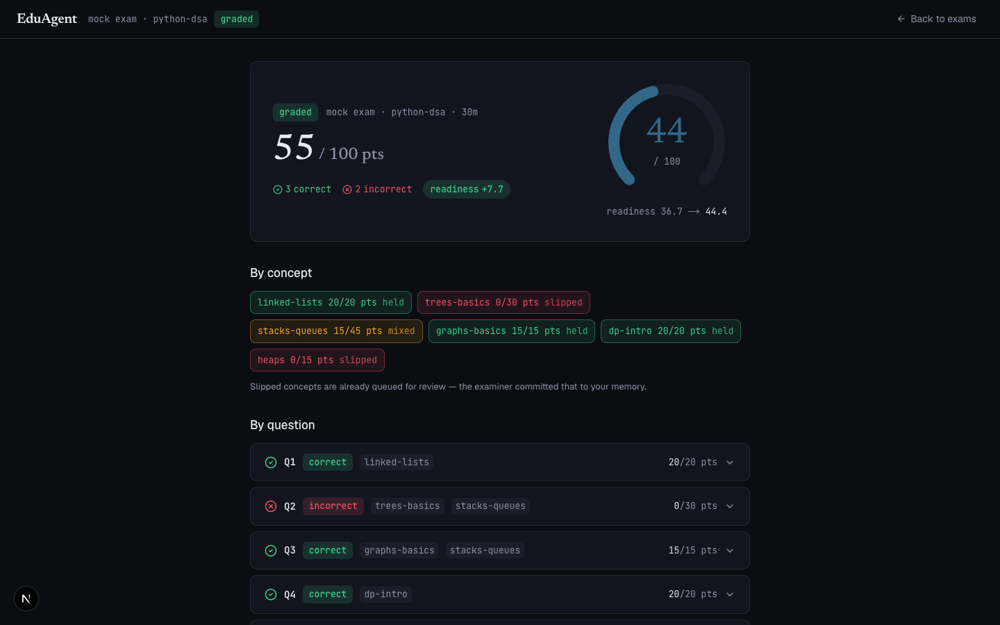
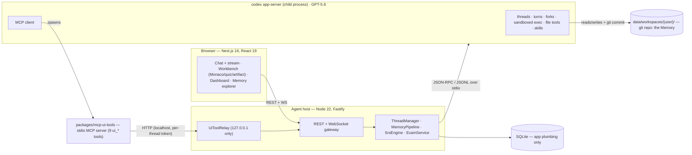

<div align="center">

# EduAgent

### The tutor that never forgets you.

An AI tutor built on **OpenAI Codex** whose memory of *you* is a **git repository**.
Every lesson ends with the agent committing an update to your knowledge model —
and you can watch it diff your brain.

[](#how-it-uses-codex)
[](#how-it-uses-codex)
[](#run-it)
[](LICENSE)

**[▶ Watch the 3-minute demo]([VIDEO_URL])** · **[Try the hosted demo](https://eduagent.aiquantized.com)** · **[Run it locally](#run-it)**

<!-- TEAM: record the 30-second commit-moment GIF (lesson → commit toast → diff drawer with
     [OPEN] → [RESOLVED]) and save it as docs/assets/commit-moment.gif, then replace this
     comment with:   -->



</div>

---

## The problem

Every AI tutor today is a goldfish. You explain your background, it teaches you something, and
tomorrow it remembers nothing — no idea what you mastered, what you misunderstood, or what
you're about to forget. Human tutors are the most effective educational intervention ever
measured *because* they accumulate a model of the student across months.

EduAgent gives an AI tutor that same longitudinal memory — and unlike a human tutor's mental
model, yours is **inspectable** (read it), **auditable** (git history), and **portable** (plain
markdown and YAML you own and can take to any agent).

## What it does

EduAgent teaches any topic; the demo vertical is **coding and CS interview prep** (SQL, Python,
data structures) — chosen because code exercises are gradable by *actually running the code* in
Codex's sandbox.

### 🧠 Memory — the star

Each learner has a git-initialized workspace the agent maintains with its own file tools:
profile, per-concept mastery YAML, a misconception log, a spaced-repetition queue, session
summaries. After every learning event the agent commits with a structured, human-readable
message. Commits surface live in the UI as toasts with a diff drawer, and the memory explorer
has a **time machine** — scrub between any two commits and diff your own learning.



### 🗺️ Tracks & roadmaps

Every learning goal gets its own track. A short wizard can take a job description, syllabus,
or self-described goal; a real planning turn reads that source and builds a completion-paced,
day-by-day roadmap. The track home opens on the roadmap, groups every learn/revise/mistakes
session beneath its day, and keeps dates as gentle hints — progress advances only when the
learner marks the day complete.

The seeded product tour shows the multi-track world directly: SQL Interview Prep is on **day
13 of 22**, while Python DS&A is on **day 3 of 12**. Completing a day advances the roadmap and
opens the exact `plan(...)` commit diff, so the learner can watch the plan itself evolve.

### 📚 Learn

Conversational tutoring driven by a pedagogy skill: Socratic questioning, small chunks,
retrieval practice. The agent pushes real artifacts into the workbench mid-conversation —
code exercises in a Monaco editor, quizzes, generated interactive visualizations — and greets
you by recalling exactly where you left off, because it read your memory before saying hello.



### 🔁 Review

A daily spaced-repetition queue computed from your memory. Unlike static flashcards, questions
are **generated fresh each time** from the learner model, attacking each concept from a new
angle. Mastery decays on the forgetting curve without review; reviews arrest the decay.



### 🎯 Exam

Interview coming up? EduAgent **forks your memory** — a real `thread/fork` of your tutor
thread — reads the learner model, and generates a timed mock exam aimed precisely at your
weakest concepts. Coding answers are graded by execution in the sandbox; results and a
readiness delta are committed back to memory.



### 📊 Dashboard

Readiness gauges per track, a mastery heatmap that shows what's *fading*, forgetting curves
with 14-day projections, streaks, and the git-log timeline of everything the tutor has ever
learned about you.

## How it uses Codex

EduAgent isn't a chat wrapper — **`codex app-server` is the product's runtime.** Our Node agent
host spawns it as a child process and speaks JSON-RPC over stdio; every product feature below is
a direct consumer of a real protocol capability:

| Product feature | Codex app-server capability |
|---|---|
| Long-lived tutoring relationship | `thread/start` / `thread/resume` — one Codex thread per (learner, mode, topic), resumed across sittings and even process restarts |
| **Exams fork your brain** | `thread/fork` of the tutor thread — the examiner inherits full pedagogical context, then diverges; `thread/inject_items` rotates it from generator to grader |
| **Auto-grading by real execution** | Sandboxed command execution (`workspaceWrite`, network off, macOS Seatbelt / Linux Landlock) — learner code runs against hidden tests inside the sandbox, never on our server |
| The agent *maintains* your memory | Codex file tools + `git` in the sandboxed workspace — the agent writes mastery YAML, misconception logs, SRS queues, and commits with structured messages |
| **Roadmaps are agentic plans, not static forms** | A dedicated `plan` thread reads the learner's source material with Codex file tools, reasons over the constraints, and writes schema-validated `track.yaml`, `brief.md`, and `roadmap.yaml` artifacts |
| **The plan itself is versioned** | Codex + `git` produce interleaved `plan(<track>): ...` commits for source capture and roadmap creation; every completion is another inspectable roadmap diff |
| **Wrap → complete closes the learning loop** | The agent calls the `ui_session_wrap` MCP tool to summarize evidence; the learner confirms completion, and the host serializes the roadmap update beside the Codex turn before emitting the commit live |
| **The agent drives our UI** | MCP — we register a stdio MCP server (`packages/mcp-ui-tools`) exposing 9 `ui_*` tools (`ui_push_exercise`, `ui_create_exam`, `ui_record_assessment`, `ui_session_wrap`, …); the model calls them mid-turn to push exercises, quizzes, wraps, and grades into the browser |
| Pedagogy that scales beyond prompts | Skills — `teach` (Socratic method, retrieval practice) and `memory` (exact file formats + commit grammar) ship as `SKILL.md` packages the model loads on demand |
| Live, streaming UX | The notification stream — `item/agentMessage/delta` token streaming, commentary-phase messages as latency masks, `item/commandExecution/outputDelta` activity chips, `turn/diff/updated` for the diff drawer, `thread/tokenUsage/updated` for quota |
| A working Stop button | `turn/interrupt` |
| Typed end to end | `codex app-server generate-ts` — our protocol bindings in `packages/shared` are generated from the CLI's own schema, never hand-written |
| Headless hosted demo | `codex login --with-api-key` against a dedicated `CODEX_HOME` at container start |

### Protocol discoveries (what deep integration actually taught us)

Everything we learned on the real wire is documented in
[`docs/PROTOCOL_NOTES.md`](docs/PROTOCOL_NOTES.md) — our empirical protocol source of truth,
built by a 14-step spike harness ([`scripts/spike-appserver.mjs`](scripts/spike-appserver.mjs))
and refined by live E2E autopsies. Highlights:

- **`workspaceWrite` marks the workspace's top-level `.git` read-only**, so agent-run
  `git commit` always fails — the memory product was impossible until we found that passing
  `writableRoots: ["<workspace>/.git"]` in the turn-level sandbox policy re-enables it
  (`.git` as a writable root has no top-level `.git` child, so the exclusion doesn't apply).
- **`approvalPolicy: "never"` does not auto-approve MCP tool calls.** Every call fires a
  server→client `mcpServer/elicitation/request` that must be answered `{action:"accept"}` or
  the tool call fails. Our client auto-accepts calls addressed to our own UI-tools server.
- **Forks and resumes silently drop `developerInstructions`.** A forked exam thread keeps
  behaving as the parent tutor — the schema accepts the param, the model never sees it. The
  working channel is **`thread/inject_items`** with a developer-role message; injected items
  persist in the rollout and a later injection supersedes an earlier one (our
  generate→grade examiner rotation).
- **Skills discovery does not walk ancestor directories** on 0.144.4 — shared skills must be
  registered via `skills/extraRoots/set` after every app-server (re)spawn.
- **`/tmp` and `$TMPDIR` are agent-writable by default** under `workspaceWrite` — we pass
  `excludeSlashTmp` + `excludeTmpdirEnvVar` so exercise files can't escape the workspace.
- **An `OPENAI_API_KEY` env var alone does not authenticate the app-server** — headless auth
  requires `codex login --with-api-key` writing `auth.json` under the target `CODEX_HOME`.
- **Codex's Linux sandbox (bundled bubblewrap) needs user namespaces inside Docker.** On an
  Ubuntu 24.04 host the default Docker profiles block it twice (AppArmor userns restriction,
  then mount propagation). Our production recipe — one host sysctl + a committed seccomp
  profile ([`deploy/seccomp/codex-landlock.json`](deploy/seccomp/codex-landlock.json)) +
  `apparmor:unconfined` on the server service only — is recorded with probe evidence in
  [`docs/DEPLOY_RUNBOOK.md`](docs/DEPLOY_RUNBOOK.md) §7 (`docker-compose.seccomp.yml`).

## Built with Codex

Codex is in this project twice, and the first way is the unusual one:

**1. The product runs on Codex.** Every tutoring session, sandboxed grading run, memory commit,
and exam fork is a real Codex session — the rollout files are the receipts. Our harvest of
runtime sessions (spike, live E2E acceptance runs, and full product dry-runs) lives in
[`docs/codex-sessions.md`](docs/codex-sessions.md).

> **Session ID demonstrating core functionality:**
> **`019f7404-6ec1-7240-b1d7-045c9caad451`** — the demo lesson run through the real product on
> the seeded learner: the tutor recalls the learner's goal and last session, pushes a SQL
> exercise, grades the wrong first attempt and the corrected one by executing them in the
> Codex sandbox, resolves a logged misconception, and commits each learning event to the
> memory repo.
> Companion: **`019f7414-72db-7833-8ef5-6e0478833761`** — the exam session *forked from that
> thread* (`forked_from_id` in its rollout meta), showing fork inheritance, injected examiner
> instructions, exam generation, and sandboxed grading in a single transcript.

**2. The product was built with Codex.** The team used the Codex CLI throughout development —
protocol spelunking, test-first implementation of the app-server client, and debugging live
E2E failures by reading rollout transcripts (that's how the fork-instruction discovery above
was made: the rollout showed the exam template text appearing *nowhere*, proving the param was
dropped). Development session IDs are logged alongside the runtime sessions in
[`docs/codex-sessions.md`](docs/codex-sessions.md).

## Architecture



Three processes at runtime: **web** (Next.js, :3000), **agent host** (Fastify, :8787, spawns
codex), and **codex app-server** itself. The MCP UI-tools server is spawned *by Codex* and
relays authenticated tool calls back to the agent host, which validates them with zod and pushes
WebSocket events to the browser.

Security posture: all learner code executes inside Codex's own sandbox (workspace-scoped, no
network); the relay binds localhost and authenticates per-thread session tokens; agent-generated
artifacts render in sandboxed iframes, never in our DOM.

**Repo tour:** `apps/web` (Next.js app) · `apps/server` (agent host: codex client, workspace +
git services, learning math, REST/WS API) · `packages/shared` (zod contracts + generated
protocol types) · `packages/mcp-ui-tools` (the MCP server) · `docs/` (protocol notes, session
log, deploy runbook) · `scripts/` (dev orchestrator, protocol spike).

**Quality:** 562 passing unit/integration tests across 53 files, plus 5 live-against-Codex
suites (four phase golden-path E2Es behind `RUN_CODEX_E2E=1` and an app-server smoke behind
`RUN_CODEX_SMOKE=1`) that boot the real production graph — real codex child, real MCP
registration — and drive it over HTTP + WS only. Dashboard scores Lighthouse 97/100 (desktop).

## Run it

### Try it now (hosted)

**[eduagent.aiquantized.com](https://eduagent.aiquantized.com)** — click **"Explore as Alex"** and enter the access code from our Devpost
testing instructions. You get the seeded learner: three weeks of history, 140+ memory commits,
a review queue due today, and an exam one click away.

### Run it locally (~10 minutes)

Prerequisites:

- **Node 22** and **pnpm 10** (`corepack enable`)
- **Codex CLI 0.144.4** (pinned — protocol behavior is version-verified):
  `npm i -g @openai/codex@0.144.4`
- A Codex-authenticated machine: run `codex login` once (ChatGPT sign-in or API key)

Then:

```sh
git clone [REPO_URL] && cd EduAgent
cp .env.example .env        # then set AUTH_MODE=local in .env  (no Clerk account needed)
pnpm install
pnpm db:setup               # Prisma migrations + client
pnpm seed                   # creates Alex (3 weeks of history) and Sam (blank slate)
pnpm dev                    # web :3000 + agent host :8787 (spawns codex app-server)
```

> **Upgrading an existing checkout?** Run `pnpm seed` once after pulling the tracks/roadmap
> upgrade. The workspace layout is generated natively and old flat track files are not migrated
> at runtime.

Open **http://localhost:3000**, and log in as **Alex** to see the full product with a lived-in
memory — or as **Sam** to experience onboarding, where your memory repo is born from the first
conversation.

<details>
<summary><b>Troubleshooting</b></summary>

- **Port 3000 already in use** — run `WEB_PORT=3105 pnpm dev` (the server reads `WEB_PORT` too,
  for its CORS allowlist).
- **Moving the agent host off :8787?** Set the pair together — the web client defaults to 8787:
  `SERVER_PORT=8797 NEXT_PUBLIC_SERVER_URL=http://localhost:8797 pnpm dev` (and `RELAY_PORT` if
  :8788 is also taken). Symptom of forgetting: the login page renders with no profiles and no error.
- **Clerk keys?** Not needed locally. `AUTH_MODE=local` swaps in a cookie-session provider with
  a profile picker — the Clerk placeholders in `.env.example` can stay as-is.
- **`NEXT_PUBLIC_SERVER_URL`** is baked at **build time** for production builds. `pnpm dev`
  handles it automatically; if you `pnpm build` for a non-default server port, set it first.
- **Turns fail with 401 / auth errors** — run `codex login status`. An `OPENAI_API_KEY` env var
  alone does *not* authenticate the app-server (see protocol discoveries above).
- **First turn is slow** — the first turn on a fresh thread reads your entire learner model
  before responding. That's the product working as intended; watch the activity chips.

</details>

## The learner model (your memory, on disk)

The entire learner model is plain files in a per-user git repo — no proprietary database, no
lock-in. What the agent maintains:

```
workspace/
├── profile.md                  # who you are: goals, background, preferences (frontmatter + prose)
├── tracks/sql-interview/
│   ├── track.yaml              # goal-oriented curriculum: ordered concepts + weights
│   ├── roadmap.yaml            # versioned, completion-paced day-by-day plan
│   ├── brief.md                # distilled goal, source requirements, and constraints
│   └── sources/                # learner-provided syllabus/JD in its original text form
├── topics/sql/
│   ├── mastery.yaml            # per-concept mastery 0–1, confidence, evidence log
│   ├── misconceptions.md       # dated [OPEN] / [RESOLVED] misconception log
│   └── notes.md                # the tutor's private pedagogical notes about you
├── srs/queue.yaml              # spaced-repetition schedule (SM-2 style)
├── sessions/                   # one narrative summary per sitting
└── exams/                      # full exam records: questions, answers, verdicts
```

Commit messages follow a grammar that both humans and our dashboard parser read:

```
learn(sql): inner-join 0.40→0.72, left-join 0.20→0.40

- Solved 2/3 join exercises without hints (ex-014 passed, ex-015 partial)
- New misconception: believes WHERE filters before JOIN completes
- Next: LEFT JOIN edge cases with NULLs
```

Effective mastery decays on a forgetting curve (`half_life = 7 · 2^review_count` days,
capped at 180); readiness per track is the weighted sum of effective mastery — and the
weakest-concepts list it produces is exactly what exam mode attacks. **"Export my memory"**
hands you the repo as an archive: your learning history is yours to keep, diff, or bring to
any other agent.

## Team & license

Built by **Yadnesh Salvi** ([@yadneshSalvi](https://github.com/yadneshSalvi)) for the
OpenAI Build Week Hackathon (Education), July 2026 — solo, with Codex as the pair programmer.

[MIT](LICENSE) — copyright 2026 Yadnesh Salvi.
